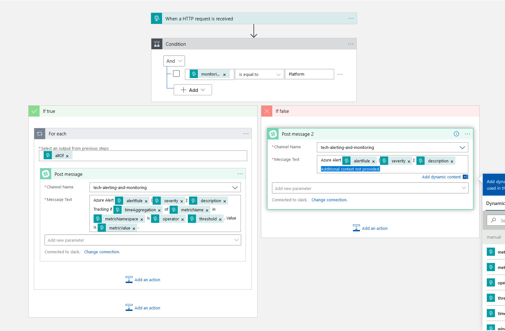
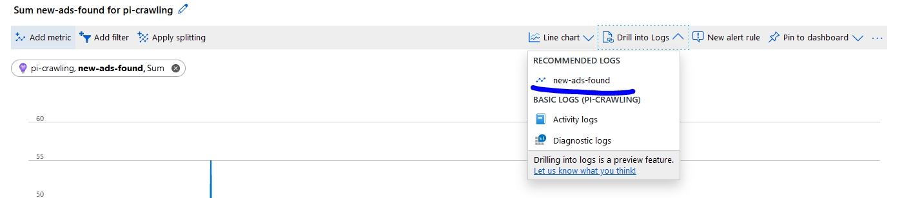
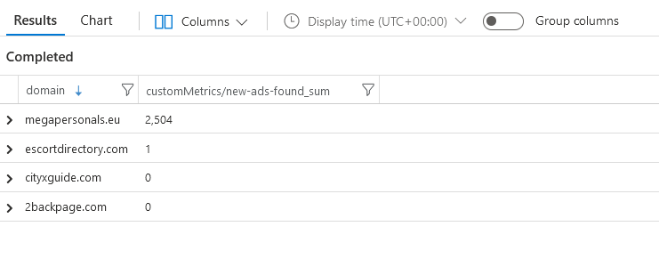

# Alert & Monitoring for Crawling

There are currently four Logic apps set up to handle alerting and monitoring. Here are their names and some brief explanations.

## Slack-Messaging-App: A Logic Endpoint for Common Schema Azure Alerts

[Alert to Slack with Logic App template](https://azure.microsoft.com/en-us/resources/templates/201-alert-to-slack-with-logic-app/)

At the time of this writing, the Logic App [Slack-Messaging-App](https://portal.azure.com/#@seattleagainstslavery.org/resource/subscriptions/eb3b9f64-5569-4792-90ad-7c5a3954c142/resourceGroups/crawling/providers/Microsoft.Logic/workflows/Slack-Messaging-App/logicApp) is used to relay an HTTP request with a Body that conforms to the [common Azure Monitor alert schema](https://docs.microsoft.com/en-us/azure/azure-monitor/platform/alerts-common-schema) to the Slack channel #tech-alerting-and-monitoring.

### Adding a New Alert to Slack-Messaging-App

If you want to relay another alert through the Slack-Messaging-App, do the following:

1. [Create an alert rule](https://docs.microsoft.com/en-us/azure/azure-monitor/platform/alerts-overview#create-an-alert-rule) in Azure Monitor for the service you're testing.
2. Under _Action group_, select the action group _Tech Slack Alerts_.
3. Give your alert rule readable and descriptive details - the name, description, and severity will all be relayed through Slack.

Slack-Messaging-App should do all the handling of the body, but if your alerts are coming through with the rule name, description, and severity but _not_ any details (i.e. with message text including 'Additional context not provided'), then the specific alert schema you're using is not yet supported by Slack-Messaging-App.

 _Note: Make sure any [action group you set up](https://docs.microsoft.com/en-us/azure/azure-monitor/platform/action-groups) to send to Slack-Messaging-App USES the Common Alert Schema, or the Logic App will not recognize input._

### Extending Slack-Messaging-App to New Incoming Schemas

At the time of this writing, Slack-Messaging-App is [integrated with the common alert schema](https://docs.microsoft.com/en-us/azure/azure-monitor/platform/alerts-common-schema-integrations) where `MonitoringService == 'Platform'`. This allows the Logic app to reference an additional AlertContext field in the HTTP request, such as the metric being measured by the alert, its value, etc. If the external trigger sending your HTTP request includes fields outside of the common alert schema you want to reference, you'll have to set up another conditional inside Slack-Messaging-App like the one that already exists and is seen below:



When you've added a new conditional, make sure previous ones still run and relay other kinds of alerts successfully. There should be a disabled Alert rule in _pi-crawling Application Insights>Alerts_ called _Dummy Alert for Slack_ you can use to test Azure alert handling with Slack-Messaging-App - it sends alerts every minute, though, so be sure to disable it once you're done!

## Scheduled-Crawling-Rollup: Daily Metric Reports from Logic

The Crawler Rollup is a scheduled process that runs every day at 10am PST. It queries metrics from:

1. *pi-crawling* Application Insights through the *Query-Crawling-App-Insights-Metrics* Logic App
2. *pi-crawl* ServiceBus through the *Query-Crawling-ServiceBus-Metrics* Logic App 

It then links their responses into a single message string and sends it to the #tech-alerting-and-monitoring Slack Channel.

### Adding a New Metric Source

If you want to add to the rollup from another source, create another Logic App akin to the two *Query-Crawling* apps that exist and return a response with a *message: string* in the body.

### Adding a New Rollup Endpoint

If you want to add a new channel, user, etc. to the Crawler Rollup, such as an email subscription, you can add a new connector to the Logic workflow after the Slack connector that leverages the _formattedRollupMessage_.

#### Formatting

[Slack message builder and API](https://api.slack.com/docs/messages/builder)

You can format from that rollup message by initializing a string variable with its value and transforming it, or by plugging in expressions like _replace_ on _formattedRollupMessage_.

_Note: The web editor automatically inserts an extra \ before any \ in strings, such that \n for newline becomes \\n automatically. To change this, build out your formatting, then go to Code view and replace \\n manually with \n wherever it is._

## Query-Crawling-App-Insights-Metrics: Azure Monitor Log Queries from Logic

[Logic Azure Monitor Logs connector](https://docs.microsoft.com/en-us/azure/azure-monitor/platform/logicapp-flow-connector) _At the time of this writing, this connector is used for Application Insights and Log Analytics workspace access._

[Expressions (functions) in Logic Workflow](https://docs.microsoft.com/en-us/azure/logic-apps/workflow-definition-language-functions-reference#all-functions---alphabetical-list)

This app queries from the Application Insights *customMetrics* table. The full process is as follows:

1. Initialize _metricsCustom_ with names of metrics to retrieve from _Application Insights>Custom Metrics_.
2. Retrieve all domain names with one or more metrics from _metricsCustom_ available.
3. For each domain:
   1. Retrieve all desired metrics.
   2. Build an array of strings (_currentDomainMetrics_) beginning with the domain name, followed by a key:value pair of each metric name: metric value.
      1. _Note: Domain name periods converted to dashes to avoid Logic errors re: property names._
   3. Append that array as a single formatted (i.e. with newlines) string to _allDomainMetrics_.
   4. Reset _currentDomainMetrics_ to empty.
4. Append each per-domain string from _allDomainMetrics_ to a single _rollupMessageString_.
5. Format that string as needed, e.g. replacing dashes with periods again.
   1. *Note: Not reverted to periods because Slack will then link from the rollup to trafficking sites.*
6. Send _formattedRollupString_ as an HTTP response.

_Note: As the above workflow may reveal, I ran into a number of issues with Logic, and anyone reading this documentation who thinks 'Wow, I could rewrite the Kusto queries/Logic workflow/etc. in a far more efficient manner,' that is probably true and would be awesome!_

#### Adding a New Metric

If the metric can be queried from customMetrics in _Logs_ and you want to Sum it, then just add its name to the HTTP request calling this app. The rest of the Logic app should handle everything for you, splitting valueSums across a day by domain.

However, if you want to do something other than retrieve and aggregate sum, you will have to create an additional array of metrics (received from HTTP trigger or, if constant, in-app) and modify the current _Azure Log Monitor connector_ queries to account for those additional columns.

if you want to query from a table that is not customMetrics, you'll also have to add to the _Query_ fields yourself, adding another section referring to your table, not _customMetrics_.

## Query-Crawling-ServiceBus-Metrics App: Azure Monitor REST API from Logic

[Service Bus available metrics](https://management.azure.com/subscriptions/eb3b9f64-5569-4792-90ad-7c5a3954c142/resourceGroups/crawling/providers/Microsoft.ServiceBus/namespaces/pi-crawl/providers/microsoft.insights/metrics)

*Query-Crawling-ServiceBus-Metrics* is a Logic App triggered by an HTTP request that, when called, retrieves the given metrics for the given queue names in the *pi-crawl* ServiceBus namespace. It is [authenticated as a managed server identity](https://docs.microsoft.com/en-us/azure/logic-apps/create-managed-service-identity#access-other-resources) with role permissions to read from ServiceBus (i.e. Identity is set on the Logic App, and Access control is given on ServiceBus as Monitoring Reader.)

*Note: To add new metrics, aggregation types, or queues, look at Scheduled-Rollup-App for the HTTP request inputs.*

The full process of the app is similar to *Query-Crawling-App-Insights-Metrics* in that it loops through provided metrics and queues, building messages into an array of strings by queue and then rolling that array into a formatted message string.

# Using Azure Alerts

You can set up alerts through Alert Rules in Azure Monitor, Application Insights, etc. that will automatically trigger certain behavior.

[Create an Azure Monitor alert from a log query](https://docs.microsoft.com/en-us/azure/azure-monitor/learn/tutorial-response) The term **Log Alert** describes alerts where a log query in [Log Analytics workspace](https://docs.microsoft.com/en-us/azure/azure-monitor/learn/tutorial-viewdata) or [Application Insights](https://docs.microsoft.com/en-us/azure/azure-monitor/app/analytics) is evaluated, and an alert fired if the result is true.

For example, you could set up Alert Rules on the [Crawling Azure CosmosDB](https://portal.azure.com/#@seattleagainstslavery.org/resource/subscriptions/eb3b9f64-5569-4792-90ad-7c5a3954c142/resourceGroups/crawling/providers/Microsoft.DocumentDb/databaseAccounts/crawling/overview) to activate behavior if the log includes an uptick in crawler failures.

1. Under Alerts on your resource of choice, add a new Alert Rule.
2. Choose your Condition for sending the Alert.
3. Choose or create an Action Group.

4. Attach to a [Webhook](https://azure.microsoft.com/en-us/blog/webhooks-for-azure-alerts/) to route alerts as JSON to an HTTP endpoint, e.g. [Slack](https://api.slack.com/messaging/webhooks#posting_with_webhooks).
   1. Optionally, [set up a Logic app](https://github.com/Azure/azure-quickstart-templates/tree/master/201-alert-to-slack-with-logic-app) to handle the webhook.

#### Where do I attach my Alert?

There's a lot of different places you can create Alert Rules. The main options are going to be _on_ the service you're looking to track or on a service analyzing its results, like Application Insights. The second option allows you to be more granular in terms of troubleshooting data, since you'll be working with generated insights, whereas the first has you working more directly with the resource's metrics.

# Using Azure Logic Apps

[Azure Logic App documentation](https://docs.microsoft.com/en-us/azure/logic-apps/)

Essentially, Logic Apps are a visual code workflow creator that allows you to connect different behavior based on a trigger. For example, you can receive an HTTP request and send a message using the body, or you can run a query on a schedule. They're pretty easy to set up, and there are a number of Templates available for Logic Apps in the documentation that let you plug-and-play.

## Triggers

#### Setting up with a Recurring Trigger

[Schedule Recurring jobs through Logic](https://docs.microsoft.com/en-us/azure/scheduler/migrate-from-scheduler-to-logic-apps#schedule-recurring-jobs)

## Connectors

### Azure Monitor Log Connector

#### Writing Your Own Queries

Queries through Azure Monitor Logs - whether to Application Insights, or to the Log Analytics Workspace where other services' metrics are streamed - are written in [Kusto query language](https://docs.microsoft.com/en-us/azure/kusto/query). Here's documentation for using it with [Azure Monitor queries](https://docs.microsoft.com/en-us/azure/azure-monitor/log-query/query-language).

To find examples of queries and test them out, see [Example queries for pi-crawling | Logs](https://portal.azure.com/#@seattleagainstslavery.org/resource/subscriptions/eb3b9f64-5569-4792-90ad-7c5a3954c142/resourceGroups/crawling/providers/Microsoft.Web/sites/pi-crawling/appInsightsQueryLogs). Specifically look at _Queries>Application Insights_ in the sidebar. This page allows you to create a New Queries for _pi-crawling Application Insights_, see the associated code, and run the query for sample data.

When you've decided on your query, just copy that code and paste it into the _Query_ field of your connector.

 _Note: You can either set the timestamp in your query, or with the Time Range field just below, which is a tiny bit more readable. If you use a dynamic from Logic in your query, you may need to set the Time Range first, then paste in, to avoid an il-Logical freakout._

##### Queries for Custom Metrics

Metrics like _new-ads-found_ are [log-based Metrics](https://docs.microsoft.com/en-us/azure/azure-monitor/app/pre-aggregated-metrics-log-metrics#log-based-metrics) generated by Application Insights. To generate a query for them, you can go to _Metrics_ under Application Insights, add a query to the chart with the filter you'd like, and then _Drill into Logs_ for it.

To find the query code for them, you can go to _Metrics_ under Application Insights, add a query to the chart with the filter you'd like - for example, getting the Sum of _new-ads-found_ - and then look at the Logs for it.



In this example, the Recommended Log for the last 3 new-ads-found in the last day is:

```
customMetrics
| where timestamp >= ago(1d)
| where name == "new-ads-found"
| extend customMetric_valueSum = iif(itemType == 'customMetric',valueSum,todouble(''))
| summarize ['customMetrics/new-ads-found_sum'] = sum(customMetric_valueSum) by bin(timestamp,1h)
| order by timestamp desc
| take 3
```

##### Grouping by Custom Dimensions

Another way you can filter your queries is by custom dimensions like _domain_ (e.g. _escortdirectory.com_). Here's an example of a query for new ads found in the past day by domain:

```
customMetrics
| where timestamp >= ago(1d)
| where name == "new-ads-found"
| extend customMetric_valueSum = iif(itemType == 'customMetric',valueSum,todouble(''))
| extend domain = tostring(customDimensions.domain)
| summarize ['new-ads-found'] = sum(customMetric_valueSum) by domain;
```



### Azure Monitor REST API with HTTP Connector

[Supported metric details by namespace](https://docs.microsoft.com/en-us/azure/azure-monitor/platform/metrics-supported) 

[Monitor metrics REST API examples](https://docs.microsoft.com/en-us/rest/api/monitor/metrics/list) 

[Finding resource providers and types](https://docs.microsoft.com/en-us/azure/azure-resource-manager/management/resource-providers-and-types)

Certain metrics are inaccessible from Azure Monitor Logs by default; they can either be set up to [stream from a service to a Log Analytics workspace](https://docs.microsoft.com/en-us/azure/azure-monitor/platform/diagnostic-settings), or some may be accessible through the Monitor REST API, which can be triggered by a Logic *HTTP action*. For example, *Querying-Crawling-ServiceBus-Metrics* checks the *DeadletteredMessages* metric from Service Bus.

*Note: Querying multiple metricnames at once via comma-separated list does not appear to be working; as a workaround, you can use a for-each metricName loop.*