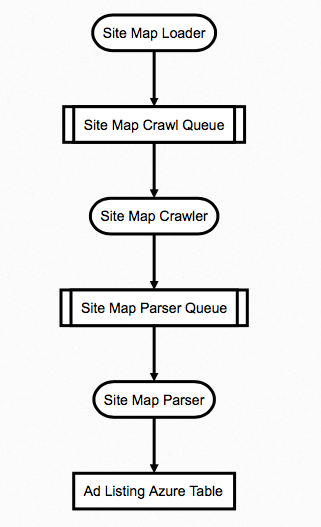

# Archicecture:

## Stage 1: Sitemapping

Site mapping is where we figure out where lists of ads live on a site. It stores those ad listing urls in an Azure Table which is used in the next stage. 

This stage is fairly self contained with a loader, a crawler and a parser.

Sitemap starts with sitemaploader on a timer. Currently it runs 1x per day. It loads crawl jobs on the sitemapcrawl queue. 

The sitemapcrawler is triggered when jobs are on the sitemap crawl queue. It takes the job, downloads the page where we could find ad listing urls and puts that page on the sitemapparse queue. 

The site map parser takes jobs from the sitemap parse queue, extracts ad listing urls and loads *new* ones into the adlistings azure table. These new adlistings are saved into the azure table.
