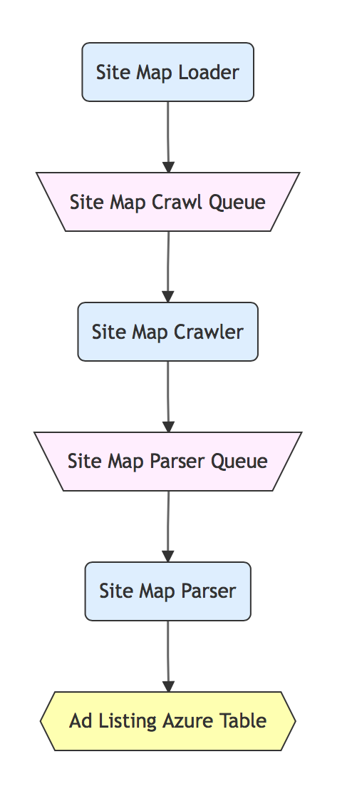

# Architecture:

The Basic archicecture has 4 stages. 

## Stage 1: Sitemapping

Site mapping is where we figure out where lists of ads live on a site. It stores those ad listing urls in an Azure Table which is used in the next stage. 

This stage is fairly self contained with a loader, a crawler and a parser.

Sitemap starts with sitemaploader on a timer. Currently it runs 1x per day. It loads crawl jobs on the sitemapcrawl queue. 

The sitemapcrawler is triggered when jobs are on the sitemap crawl queue. It takes the job, downloads the page where we could find ad listing urls and puts that page on the sitemapparse queue. 

The site map parser takes jobs from the sitemap parse queue, extracts ad listing urls and loads *new* ones into the adlistings azure table. These new adlistings are saved into the azure table.

## Stage 2: Ad Listings

Ad listings is all about collecting urls for individual ads. It puts the ad urls on the ad-crawl queue to start the next stage. We also will do depth crawling in this stage.

Similar to sitemapping this stage contains a loader, crawler and parser, however this ends in a queue instead of a crawl.

The Ad listing loader starts on 1x hour timer. It loads ad listing crawl jobs onto the adlisting crawl queue.

The ad listing crawler takes jobs from the adlisting crawl queue, downloads the url and puts the page on the adlisting parse queue.

The ad listing parser then extracts the individual ad urls. It then checks the azure ad table to see if the ad url has alredy been crawled.

This is also how we do depth crawling. Depth crawling is where we go 'deeper' into the site to collect more ads. Typically on a 'craglist' style site that means that we'd go to the next page to find more ads. We do depth crawling when there's more than 70% new ads on the page. This works well in practice because more sites are slow moving (at least on an hourly basis).

If we've not crawled the ad then it will put the ad on the ad crawl queue for the next stage.

## Stage 3: Ad Crawling

Ad Crawlers are all about collecting and processing the ad data. It starts with the ad crawl queue and ends with the processing queue. 

This starts with the ad crawler pulling a job from the ad crawl queue. First it checks to see if we have already crawled. If the ad url has already been crawled the job is done.

If we need to crawl the ad url the crawler will get the ad html, store it in Blob Storage, mark the ad crawled in the azure ad table then put the job on the ad parser queue.

The ad parsers are where we extract the data from the ads. This is the key step in turning raw html into structured data. The parsers pull the job from the queue, mark it as parsed. It puts the exacted data on the processing queue for the final stage.

If there are images in the ad, the parsers will check to see if the images have already been crawled, if they haven't it will add them to the image crawl queue. 

Image crawlers will check to see if we've crawled the images, and if not it will crawl the image and save it into blob store. The images are saved by encoding the url and can be pulled from blob store by their url. 

## Stage 4: Processing

This is the simplest of all the stages, but can be developed further.

The processor will pull from the processing queue and store the raw data into the CosmosDB as a document. 

Right now it's just pass through, but this is where we can control what data we trust more. 

For example, we could have logic that says "use the gender from the ad, then fall back to the ad listing gender, then fall back to the sitemap gender". 

