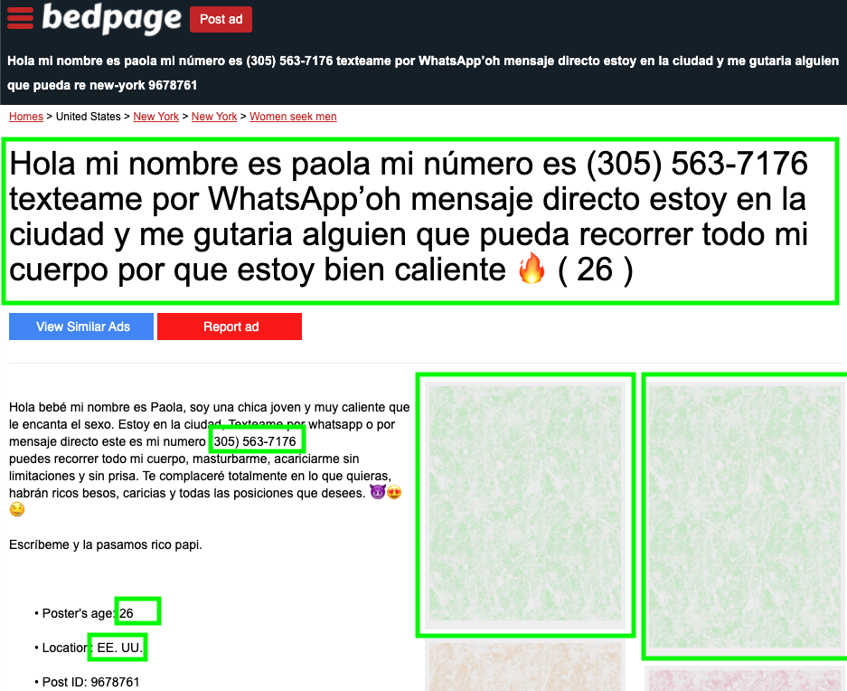
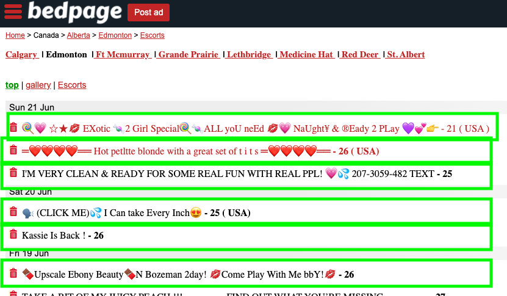
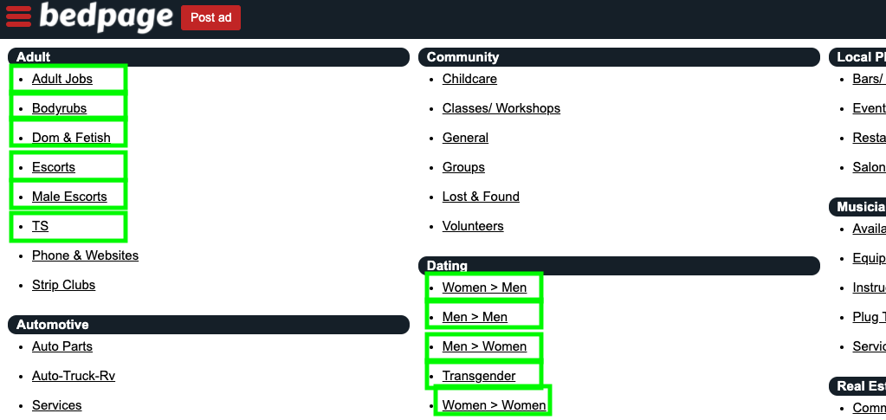

# A Walkthrough Guide to Creating a New Parser

A bit of context:
Seattle Against Slavery crawls sites where people post ads for paid sex. We then provide local organizations a platform to reach out to the posters of those ads in bulk. While we are not everywhere in the world (yet!), we do crawler every link we can to collect as much information as possible.

Before you get started, be sure to check out the [design doc](./design.md) to understand the set up and provide context for your new parser. This doc is intended as a guide to go step-by-step through all the things you need to do to open a complete pull request for a new crawler.


💡 Pro-tip: you can disable images in your browser before doing this work if you are going to use the devtools to inspect elements to grab ids or classnames. This will help limit your exposure if you are sensitive to the imagery. We recommend disabling images in [your Chrome settings](chrome://settings/content/images) or with [this extension](https://chrome.google.com/webstore/detail/wizmage-image-hider/ifoggbfaoakkojipahnplnbfnhhhnmlp).

## Important Words to Understand:

### Ad

This is the post that users of the site create to sell sex. You can see right off the bat some of the information we'll want to scrape off the ad.

Something like this:



### Ad Listing

This is the page that lists out all of the links to ads in the particular location and/or category.

Something like this:




### Site Map

The site map is usually the landing page of a site.

i.e. the page where all the different categories or locations are listed out.

Something like this:


### Another helpful page

Though we don't crawl this page directly or need to download it, it is often useful to go to it to get the links for categories of interest.

Something like this:



You can see that we want to scrape most of the things in the `Adult` category but we will ignore the `Auto Parts` section.


## Ready to Roll?

We use [Beautiful Soup](https://www.crummy.com/software/BeautifulSoup/bs4/doc/) to parse out relevant information from the site. Not all sites will have [all the information we are looking for](https://docs.google.com/spreadsheets/d/15dozBkEIOvezsNphgZzVHFDKuCnPkxPiji-0aSTbw1s/edit#gid=0).

### Step 1: Creating an Ad Parser
---

#### Collect Ads
> Search around and find five ads from the site. Choose some from different categories, as well as varying levels of detail included in the ads. For each ad, save it's html in

[`__app__/adparser/tests/test-html`](../blob/master/__app__/adparser/tests/test-html)

> Paste the HTML from the ad you want to parse.


> Be sure to give the file a name that includes the site you are looking at and the date (`YYYYMMDD`) following the pattern from other filenames.

#### Code the site's adparser
> Create a new file for the parser in

[`__app__/adparser/sites`](../blob/master/__app__/adparser/sites)

> Check out the other parsers in the directory. You'll see they all have the same methods. Copy the methods in

[`base_ad_parser.py`](../blob/master/__app__/adparser/sites/base_ad_parser.py)

> so that you can be sure you got them all.

> This is the main work of creating a crawler. While we are trying to get as much information as possible we are not processing the data, so no need to unique or sort arrays.

> To start to figure whether you are scraping the site effectively, open the repl in your terminal by typing

`python`

> Now you can load one of the html files you created and start trying to find the data you'd like to extract.

```
import os
import re
from bs4 import BeautifulSoup
file_path = "__app__/adparser/tests/test-html/{INSERT THE NEW FILENAME YOU JUST CREATED}.html"
html = open(file_path, encoding="utf8").read()
soup = BeautifulSoup(html, "html.parser")
# soup.find("title").string
```

#### Test Your Adparser Code

> Add the expected JSON file for the ad to

[`__app__/adparser/tests/test-data`](../blob/master/__app__/adparser/tests/test-data)

> This file contains the data you expect your parser will scrape from the ads. Your creation of this file will ensure that running the html files through your adparser code generated the expected results.

> Before you run the tests, ad your new adparser into this file:

[`__app__/adparser/adparser.py`](../blob/master/__app__/adparser/adparser.py)

> Add an import statement for your parser:

  `from __app__.adparser.sites.cityxguide_com import CityXGuide`

> Add the domain and the parser name to the `AD_PARSERS` dictionary:

  `AD_PARSERS = { "cityxguide.com": CityXGuide, ... }`

> Now run the tests!

`python -m pytest`

> If you want more details on failures and to be able to see things you print to the screen, run it like this:

`python -m pytest -vv -s`

> Once you have the tests passing, you're reading to move on to the ad listing parser.

### Step 2: Creating an Ad Listing Parser
---

#### Collect Ad Listings
> Search around and find five ad listings from the site. Choose some from different categories. For each ad listing, save it's html in

[`__app__/adlistingparser/tests/test-html`](../blob/master/__app__/adlistingparser/tests/test-html)

> As before, following the established file naming convention.

#### Code the site's adlistingparser

> Create a new file for the parser in

[`__app__/adlistingparser/sites`](../blob/master/__app__/adlistingparser/sites)

> Check out the other parsers in the directory. You'll see they all have the same methods. Copy the methods in

[`base_adlisting_parser.py`](../blob/master/__app__/adlistingparser/base_adlisting_parser.py)

> so that you can be sure you got them all.

#### Test Your Adlistingparser Code

> Add the expected JSON file for the ad listing to

[`__app__/adlistingparser/tests/test-data`](../blob/master/__app__/adlistingparser/tests/test-data)

> This file contains the data you expect your parser will scrape from the ad listings.

> Before you run the tests, add your new adlistingparser into this file:

[`__app__/adlistingparser/adlistingparser.py`](.../blog/master/__app__/adlistingparser/adlistingparser.py)

> Add an import statement for your parser:

  `from __app__.adlistingparser.sites.cityxguide_com import CityXGuide_com`

> Add the domain and the parser name to the `AD_LISTING_PARSERS` dictionary:

  `AD_LISTING_PARSERS = { "cityxguide.com": CityXGuide, ... }`

> Now run the tests as before!

`python -m pytest`

> Once you have the tests passing, you're reading to move on to the site mapping parser.

### Step 3: Creating a Site Map Parser
---

#### Collect the Site Map
> Save the Site Map's html in

[`__app__/sitemapparser/tests/test-html`](../blob/master/__app__/sitemapparser/tests/test-html)

> As before, following the established file naming convention.

#### Code the site's sitemapparser

> Create a new file for the parser in

[`__app__/sitemapparser/sites`](../blob/master/__app__/sitemapparser/sites)

> Check out the other parsers in the directory. You'll see they all have the a single method, which returns the urls for all of the relevant adlistings pages.

#### Test Your Sitemapparser Code

> Add the expected JSON file for the ad listing to

[`__app__/sitemapparser/tests/test-data`](../blob/master/__app__/sitemapparser/tests/test-data)

> This file contains the data you expect your parser will scrape from the site map.

> Before you run the tests, add your new sitemapparser into this file:

[`__app__/sitemapparser/sitemapparser.py`](.../blog/master/__app__/sitemapparser/sitemapparser.py)

> Add an import statement for your parser:

  `from __app__.sitemapparser.sites.cityxguide_com import CityXGuide_com`

> Add the domain and the parser name to the `SITE_PARSERS` dictionary:

  `SITE_PARSERS = { "cityxguide.com": CityXGuide_com, ... }`

> Now run the tests as before!

`python -m pytest`

> Once you have the tests passing...


